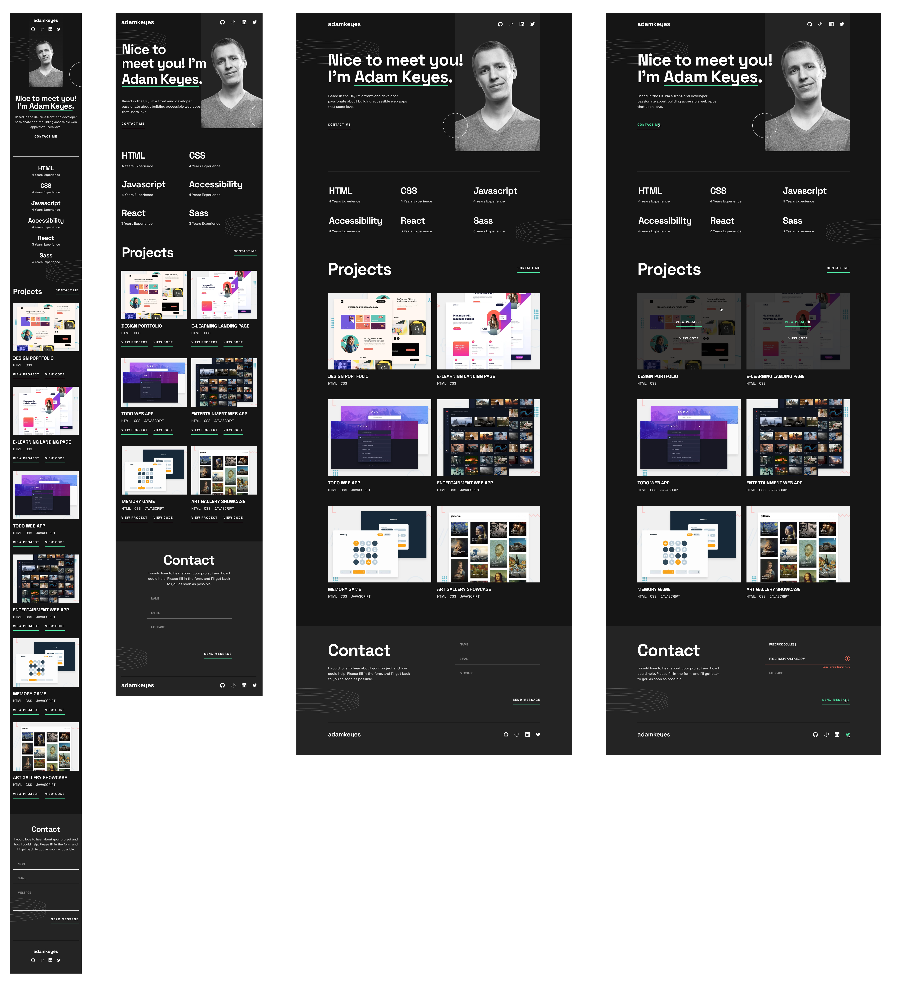

# Responsive Web Project- Portfolio

### Características
**Diseño adaptable**: El sitio está optimizado para diferentes tamaños de pantalla, incluyendo móviles, tablets, y pantallas de escritorio grandes y extra grandes.

**Desarrollo rápido**: Uso de Vite como herramienta de desarrollo para mejorar el rendimiento durante el desarrollo y la compilación.

**SASS**: Se utiliza SASS para estructurar los estilos.

**JavaScript**: Funcionalidades interactivas para el formulario de contacto

**Responsividad**: La página adapta su diseño en función del tamaño de la pantalla, usando media queries en SASS para diferentes resoluciones:
- Móvil:  375px .
- Tablet: 768px.
- Pantalla grande: 1200px .
- Pantalla extra grande: 1440px.